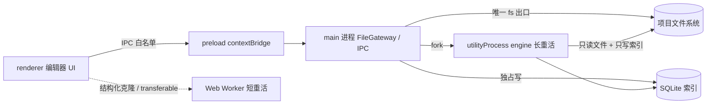
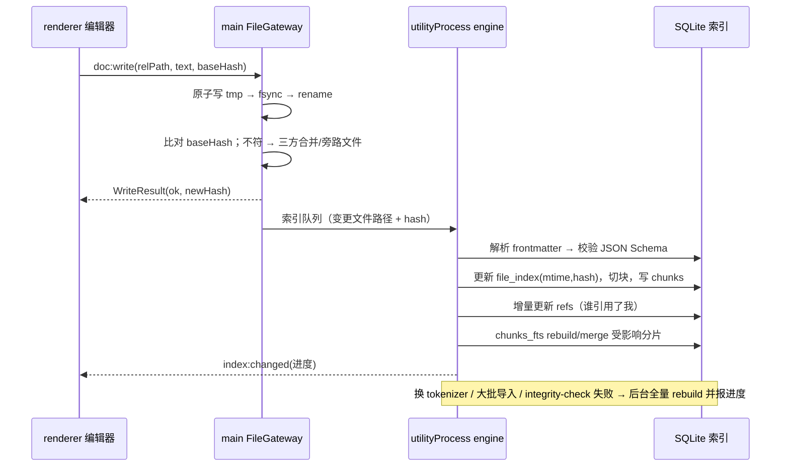
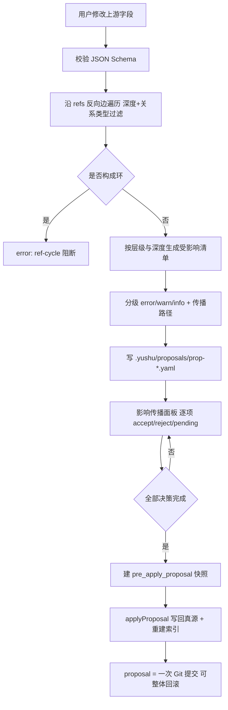

# 御书 · 开发规划方案

> **一句话定位：御书以「世界引擎 + 派系包 + 分层记忆 + 一致性引擎」四件套为骨架，用本地优先、Markdown 真源、AI 副驾可审计的架构，把「从起源构建世界」落成可执行的技术方案。**
>
> 文档版本：M0 规划期 ｜ 上游：docs/01-需求总纲、docs/02-竞品与参考项目分析、G06 派系包建模 ｜ 下游：docs/04-开发计划

本文档是御书的技术架构总方案，承接交接文档 §6.2 的 14 项硬性要求：§2 分层架构图、§3 进程边界、§4 包结构、§5 数据模型、§6 索引同步、§7 影响传播、§8 派系包规范、§9 Provider 能力矩阵、§10 记忆与上下文、§11 一致性引擎、§12 版本与导入、§13 安全、§14 性能预算、§15 技术债务与迁移。所有技术选型均给出**选择理由 / 备选方案 / 锁定风险**三要素；引用调研结论一律用编号（如"详见 K05""规则 DSL 承接 G06"），不引外部链接。术语与 docs/01 保持一致：**派系包、世界引擎、记忆系统、一致性引擎、起源工作台**。绝不触碰的红线来自交接文档 §9：**派系不做单选下拉、世界模型不做强制巨型表单、AI 不直接覆盖正文或设定、SQLite 不是唯一真源、平台规则外置**。

---

## 1. 总则与设计约束

### 1.1 由宗旨推导的架构约束

「从起源构建世界」不是宣传语，而是最高设计约束（docs/01 §2）：一部作品 = 一个 `World` + 世界中展开的故事，章节只是世界的叙事切面。因此架构必须保证：

1. **世界是第一公民**：`World` 是根实体，章节、人物、势力都是它的下游切面，而非平级文件。
2. **自上而下推演、上游变更向下游传播**：起源→法则→地理→生态→历史→文明→社会→人物→故事（交接文档 §5.1），依赖图必须显式可遍历。
3. **流派可组合而非单选**：四维派系（频道×世界×手法×基调，docs/01 §3.1）以数据注入实现，内核最小化（docs/01 §3.3）。
4. **一致性是生命线**：战力、历史、时间线、称呼、声线、规则、伏笔都有结构化约束与独立校验层。

### 1.2 五条工程红线（架构级不可违背）

| 红线 | 架构落点 |
|---|---|
| 派系不做单选 | `genre_axes` 多维数组 + 融合预演报告（§8） |
| 世界模型不做巨型表单 | 层级启用开关 `layers` + 渐进披露（§5、§7） |
| AI 不直接覆盖真源 | 一切 AI 产出走"候选 → diff → 采纳 → 写库"（§10、§12） |
| SQLite 非唯一真源 | 索引表全部由文件派生的 external content（§6） |
| 平台规则外置 | 规则包带来源、生效日期、版本号（§8、§12） |

### 1.3 基线技术栈（docs/01 §2.2）

Electron + React + TypeScript；正文 TipTap/ProseMirror、源码 CodeMirror 6；Markdown + YAML frontmatter 为真源、TOML 存项目开关；SQLite 仅作索引；FTS5 + 中文分词；sqlite-vec（保留替代）；OpenAI Chat Completions 兼容主干；Pandoc + EPUBCheck 导出。

---

## 2. 产品分层架构（要求 1）

采用"应用层 / 引擎层 / 数据层"三层，**AI 副驾作为横切关注点**贯穿三层，但默认关闭、逐项开启（docs/01 §4.5、§6）。分层原则承接 K05 的"分层四层分离"（world data / generators / editors / renderers）：修改一层不破坏其他层。

```mermaid
graph TB
  subgraph 应用层["应用层 Application（Renderer）"]
    WB[起源工作台 Genesis Workbench]
    ED[编辑器 富文本 TipTap / 源码 CodeMirror6]
    OB[大纲系统 总纲·卷纲·章纲]
    MP[关系图谱 / 时间线 / 地图]
    SR[检索与全局搜索]
    AG[AI 副驾面板 上下文预览器·候选 diff]
    AU[作者刚需套件 码字统计·防丢稿·敏感词]
    PB[出版与导出]
  end

  subgraph 引擎层["引擎层 Engine（Main + utilityProcess）"]
    WE[世界引擎 World Engine 分层模型·依赖图·影响传播]
    GE[流派引擎 Genre Engine 派系包加载·融合·规则注入]
    ME[记忆系统 Memory 五层记忆·上下文组装]
    CE[一致性引擎 Consistency 规则校验·幻觉检测]
    SE[搜索索引 Search FTS5+向量]
    EX[导出管线 Export Pandoc·EPUBCheck]
  end

  subgraph 数据层["数据层 Data"]
    MD[(Markdown + YAML 真源 项目目录树)]
    TOML[(project.toml 项目配置)]
    IDX[(SQLite 索引 .yushu/index.db 可重建)]
    GIT[(Git 版本层 / 快照对象库)]
    SEC[(加密凭据库 safeStorage)]
  end

  subgraph 横切["AI 副驾（横切，默认关闭）"]
    LLM[@yushu/llm Provider 路由·fallback·成本]
  end

  WB --> WE
  ED --> WE
  OB --> WE
  MP --> WE
  SR --> SE
  AG --> ME
  AU --> WE
  PB --> EX

  WE --> MD
  WE --> IDX
  GE --> WE
  GE --> MD
  ME --> IDX
  ME --> MD
  CE --> WE
  CE --> IDX
  SE --> IDX
  EX --> MD

  LLM -. 只读注入 · 只写候选 .-> ME
  LLM -. 能力矩阵路由 .-> CE
  LLM -. 只存 key_ref .-> SEC
  GIT --- MD
  IDX -. 可从 MD 全量重建 .-> MD
```

**关键不对称设计**：真源（MD/YAML）只被"写入"，索引（SQLite）只被"派生"；一致性引擎与记忆系统只**读**真源、只**经由用户确认**回写。

**选择理由**：三层分离对应 K05 的可裁剪依赖管线与 K13 的"重计算出主进程"；AI 横切而非独立层，保证"AI 可整体关闭后所有本地功能仍完整"（docs/01 §7 验收基线）。
**备选方案**：全进程内单层紧耦合（开发快但无法验证数据主权与离线基线，已否决）。
**锁定风险**：横切耦合易导致 AI 逻辑渗透进核心包，须以 §4 的依赖方向规则强制隔离。

---

## 3. Electron 进程边界与职责（要求 2）

承接 K04"渲染层不直连文件系统"铁律与 K13"重计算出主进程"。五类执行单元的边界与职责：

| 单元 | 运行环境 | 职责 | 禁止 |
|---|---|---|---|
| **main 进程** | Node | 窗口与生命周期；FileGateway 唯一 fs 出口；SQLite 独占写；IPC 路由；凭据解密；Git/快照调度 | 跑长任务、阻塞 UI 线程 |
| **preload** | 隔离世界 | 经 `contextBridge` 暴露白名单 API（一消息一方法）；不做业务逻辑 | 透传 `ipcRenderer`、暴露任意通道 |
| **renderer** | Chromium / Web | 编辑器 UI、交互与渲染、视图层 Decoration | `import fs/path`、直接写文件、开 `nodeIntegration` |
| **Web Worker** | renderer 内 | 渲染侧同时长任务：软换行重排、字数统计、局部 diff、语法高亮 | 触碰 DOM/文件系统 |
| **utilityProcess** | Node 子进程 | 引擎重计算：分章、实体抽取、索引构建、全文统计、一致性校验、导出打包 | 直接暴露给渲染层 |



**IPC 契约**（承接 K04 §5）：`project:open/close/tree`、`doc:read/write/rename/changed`、`index:query/rebuild`、`app:config/crashInfo`。所有写操作携带 `baseHash` 以做并发冲突检测；`doc:changed` 由主进程向渲染层推送（chokidar + `atomic` + `awaitWriteFinish`，自身写入加 500ms 忽略窗口）。

**选择理由**：Electron 多进程天然提供"渲染崩溃不拖垮主进程"的崩溃恢复基础（K04）。**备选方案**：渲染层直连 fs（Fast 但破坏 context isolation 与数据主权，已否决）。**锁定风险**：`utilityProcess` 与主进程共享同一个 SQLite 文件，须坚持"主进程独占写"避免 WAL 单写者争用。

---

## 4. 包结构（要求 3）

Monorepo（pnpm workspace）按"核心最小化"（docs/01 §3.3）拆分。**依赖方向严格单向**：`apps → 引擎包 → core → 无依赖`；`llm` 与 `search` 只能被引擎包调用，不得反向依赖 UI。

```text
packages/
├── @yushu/core           # 最小通用内核：World/Entity/Relation/Event/Chapter/Foreshadow 类型、ID 与命名空间、异常、序列化基元、事件总线
├── @yushu/world-engine   # 分层数据模型、依赖图、影响传播、提案 proposal、层级裁剪
├── @yushu/genre-engine   # 派系包加载/校验/融合、schema 扩展点注册、规则 DSL 求值沙箱
├── @yushu/memory         # 五层记忆、别名提及追踪、上下文组装与 Token 预算
├── @yushu/llm            # Provider 描述/能力矩阵、任务路由、fallback/重试/冷却/并发
├── @yushu/search         # FTS5+中文分词、sqlite-vec 向量、RRF 混合检索
├── @yushu/export         # Pandoc 管线、EPUBCheck 门禁、平台格式适配
└── @yushu/schema         # JSON Schema 仓库 + 迁移器（被 core/world-engine 共用）
apps/
├── desktop               # Electron 主进程 + preload + renderer 装配
└── cli                     # 无头能力（重建索引、批量导出、QA）
```

| 包 | 对外接口（要点） | 依赖 |
|---|---|---|
| core | `parseFrontmatter() / serializeCard() / makeId() / EventBus` | — |
| world-engine | `loadWorld() / buildDepGraph() / propagate(change) / applyProposal()` | core, schema |
| genre-engine | `loadPack() / lintPack() / fuse(packs[]) / evalRule(rule, ctx)` | core, schema |
| memory | `assembleContext(anchors) / trackMentions() / summarize()` | core, search |
| llm | `chat() / stream() / route(task) / cost()` | core |
| search | `indexFile() / rebuild() / query() / embed()` | core |
| export | `exportTask() / runEpubCheck()` | core |

**选择理由**：引擎与 Electron 解耦（交接文档 §2.2），为未来评估 Tauri 与 CLI/无头批处理保留路径；包边界即一致性引擎的可测试边界。**备选方案**：单体单包（省事但架构腐化快，已否决）。**锁定风险**：`core` 若不守"最小"，流派差异会重新渗回内核，违背 docs/01 §3.3。

---

## 5. 数据模型（要求 4）

以 YAML/TypeScript 伪代码给出字段级定义。所有实体 ID 采用**稳定命名空间**形式（`char-*`、`loc-*`、`fac-*`、`ev-*`、`ch-*`、`fs-*`、`pack_id/element_id`），引用一律写 ID、不写显示名（改名不破坏引用，K05）。

### 5.1 World 根与层级开关（渐进披露，非巨型表单）

```yaml
# world/world.yaml
apiVersion: yushu.world/v1
id: world-tianqi
title: 天启界
layers:                      # 层级启用开关：未启用层不参与校验与传播
  genesis: true
  laws: true
  geography: true
  ecology: false             # 现实都市可关闭（交接文档 §9.3）
  eras: true
  civilizations: true
  factions: true
  characters: true
  events: true
  storylines: true
  chapters: true
required_fields: [id, title, genre_axes]   # 仅少量必填，其余渐进补充
```

### 5.2 Entity（通用头 + 派系包 schema 扩展）

```typescript
interface EntityBase {
  id: string;                // 稳定 ID，如 char-linyuan
  type: string;              // 由派系包 schema 扩展点注册（G06）
  layer: LayerKey;           // genesis | laws | geography | ... 
  name: string;
  aliases: string[];         // 别名/尊称/外号 → 提及追踪与触发注入（J03）
  refs: RelationRef[];       // 外键式引用（写 ID）
  source_chapters: string[]; // 出场章节
  visibility: 'written_unrevealed' | 'foreshadowed' | 'revealed' | 'hidden';  // 冰山原则
  format_version: number;
  extensions?: Record<string, unknown>;  // 派系包注入字段（境界/威胁等级/公司商业）
}
interface RelationRef { relation: string; target: string }  // relation 词表可被派系包扩展
```

### 5.3 Relation / Event / Timeline / Storyline / Chapter / Foreshadow

```typescript
interface Relation { id: string; from: string; to: string; kind: string;   // 血缘/效忠/敌对/隶属/师徒…
  directed: boolean; strength?: number; since_chapter?: string; note?: string }

interface Event { id: string; title: string; year: number;                // 内部统一数字刻度
  timeline: string; participants: string[]; location?: string;
  causes: string[]; effects: string[]; pov_viewpoints?: PovView[] }        // 多文化"伪史书"

interface Timeline { id: string; anchor_event: string;                     // 锚定事件 = Year 0
  calendar: string;                                                        // 多历法渲染层映射（F05）
  scale: 'numeric'; events: string[] }

interface Storyline { id: string; kind: 'main' | 'sub' | 'romance';
  beats: BeatRef[]; promises: string[]; status: 'open' | 'closed' }        // 与伏笔/悬念台账互链

interface Chapter { id: string; volume: string; idx: number; title: string;
  pov: string; word_count: number; status: 'draft' | 'revised' | 'published';
  outline_ref: string; scene_ids: string[];                               // 三级大纲双向映射
  summary: string; summary_rev: number }                                   // summary_rev>0 时 AI 不得覆盖

interface Foreshadow { id: string; name: string; promise: string;
  plant_chapters: string[]; carrier: '道具'|'对白'|'意象'|'事件'|'传闻';
  visibility: '显写'|'半遮'|'藏枪'; expected_payoff_chapter: string;
  payoff_type: string; is_red_herring: boolean;
  state: 'planted'|'reinforced'|'due'|'paid'|'abandoned';
  abandon_reason?: string; recheck_after: number }                         // 承接 F08 台账
```

### 5.4 GenrePack（派系包，**以 G06 为唯一输入，不另起格式**）

```yaml
apiVersion: yushu.pack/v1          # 包格式版本（semver + 引擎兼容区间）
kind: GenrePack
metadata:
  id: xuanhuan-xitong              # 全局唯一，作命名空间前缀
  name: 男频玄幻·系统流
  version: 1.2.0
  license: CC-BY-4.0
  requires: {yushu: ">=0.4.0"}     # 引擎兼容区间
genre_axes:                        # 四维声明（与 docs/05 同一词表，多维数组）
  {channel: [男频], world: [玄幻], technique: [系统流], tone: [爽文], romance_mode_default: none}
content:                           # 11 件套，对应 docs/01 §3.2
  world_preset: presets/world.yaml
  schema_extensions: [schemas/境界体系卡.yaml, schemas/系统面板卡.yaml]
  rules: [rules/power-consistency.yaml, rules/realm-progress.yaml]
  beat_sheets: [beats/upgrade-cycle.yaml]
  satisfaction_patterns: [patterns/face-slap.yaml]      # 爽点模式库（G05 结构）
  prompt_templates: [prompts/continue.yaml]
  glossary: glossary.yaml
  taboos: taboos.yaml
  outline_templates: [outlines/three-act-upgrade.yaml]
  evolution: {origin_work: 《斗破苍穹》, era: 2009, chain: [开山:斗破苍穹 → 仿作 → 反套路]}
  platform_mapping: mappings.yaml                        # 平台映射（外置、带版本）
fusions:
  compatible_with: [fanren-liu]
  conflicts_with:
    - {pack: guiju-guaitan, reason: 规则解谜节奏与战力爽点节拍冲突}
```

**选择理由**：稳定 ID + 命名空间 + 覆写分层，直接复用游戏 Mod 数据格式的共同模式（G06 §2）。**备选方案**：包内扩展点用代码插件而非声明式 YAML（不可分享、不可 lint，已否决）。**锁定风险**：`genre_axes` 若与 docs/05 词表脱钩会造成分类漂移，须在 lint 中校验词表一致性。

---

## 6. Markdown/YAML 真源 → SQLite 索引（要求 5）

**真源永不进 SQLite**。所有索引表使用 FTS5 `external content`（`content='chunks'`），索引只是正文的派生物，可 `INSERT INTO fts(fts) VALUES('rebuild')` 随时全量重建（K03/K09 官方依据）。索引库位于 `.yushu/`，**排除于 Git 与网盘同步目录**（WAL 不支持网络文件系统，K04）。

```sql
-- 索引 schema（真源为 Markdown+YAML；此库可删除、可重建）
CREATE TABLE entities(id TEXT PRIMARY KEY, type TEXT, layer TEXT, file_path TEXT);
CREATE TABLE refs(referrer TEXT, relation TEXT, target TEXT);         -- 反向索引：谁引用了我
CREATE TABLE chunks(id TEXT PRIMARY KEY, chapter_id TEXT, volume TEXT, kind TEXT,
                    text TEXT, char_start INT, char_end INT, text_hash TEXT, entities TEXT, tokens INT);
CREATE VIRTUAL TABLE chunks_fts USING fts5(text, entities UNINDEXED,
                    content='chunks', content_rowid='id', tokenize='simple');  -- 中文+拼音
CREATE TABLE file_index(path TEXT PRIMARY KEY, mtime TEXT, hash TEXT, indexed_at TEXT);
CREATE INDEX idx_chapters_list ON chapters(volume, idx, id, title, word_count);  -- 覆盖索引（K13）
```

**同步时序**（保存即增量、异常即自愈、导入/换分词器即全量）：



**选择理由**：`file_index(mtime+hash)` 支撑增量（K09/K04），`rebuild` 支撑自愈，兑现"删除索引零数据丢失"（docs/01 §6）。**备选方案**：以 SQLite 为唯一真源（开发简单但破坏数据主权，交接文档 §9.5 明确禁止）。**锁定风险**：分词器切换会触发全量重建，须在项目配置中显式记录 `tokenizer` 并与建表声明校验一致。

---

## 7. 影响传播、依赖图与用户确认（要求 6）

承接 K05：外键式引用 + 反向索引构成依赖图，沿用 Azgaar 分层管线与"拓扑序即重算顺序"的思想。修改上游字段即触发**反向遍历**，产出 proposal 报告，**未逐项确认不得落库**（docs/01 §4.2、avoid 静默覆盖）。



**传播伪代码**：

```typescript
function propagate(change: FieldChange): Proposal {
  const refs = db.prepare(`SELECT referrer, relation FROM refs WHERE target=?`).all(change.entity);
  const impact = bfs(refs, { maxDepth: 3, decay: (relation) => relationWeight(relation) });
  if (hasCycle(impact)) throw new RuleError('ref-cycle');
  return {
    proposal_id: makeId('prop'),
    change,
    impact: impact.map(i => ({
      entity: i.id,
      relation: i.relation,
      depth: i.depth,
      severity: i.structural ? 'error' : (i.semantic ? 'warn' : 'info'),
      path: i.path,                       // 显式传播路径：law→geo→civ
    })),
    status: 'awaiting_confirmation',
  };
}
```

传播报告样例（承接 K05 §5）：

```yaml
proposal_id: prop-20260929-01
change: {entity: law-lingqi, field: spiritual_density, from: 0.6, to: 0.3}
impact:
  - {entity: geo-qingyun, relation: derived_from, depth: 1, severity: warn, path: [law-lingqi, geo-qingyun]}
  - {entity: civ-danxia,  relation: depends_on,  depth: 2, severity: warn, path: [law-lingqi, geo-qingyun, civ-danxia]}
confirmations:
  - {entity: geo-qingyun, decision: accept}
  - {entity: civ-danxia,  decision: pending}
status: awaiting_confirmation
```

**分级规则**：结构破坏（悬空 `ref-dangling`、环 `ref-cycle`、层级倒置 `layer-order-violation`）→ error；跨层语义冲突（交 §11 一致性引擎）→ warn；仅提示 → info。**未启用层不参与校验与传播**（`layer-disabled-ref` 仅 warn）。
**选择理由**：结构信号 + 语义信号融合、每条结论挂传播路径（K05）。**备选方案**：仅文本相似度做影响分析（无词重叠即漏报，已否决）。**锁定风险**：传播深度与衰减权重若过激会噪音爆炸，须提供"自动接受安全集"边界与用户校准。

---

## 8. 派系包规范、schema 扩展点、规则 DSL、融合冲突（要求 7）

本节**以 G06 为唯一输入并承接其草案**，不另起格式。manifest、schema 扩展点、规则 DSL、融合表均原样承接；`@yushu/genre-engine` 只增加工程载荷（加载器、lint、沙箱、完整性 hash，详见 K06）。

### 8.1 schema 扩展点（承接 G06）

```yaml
# schemas/境界体系卡.yaml —— 继承核心通用设定卡（core/setting-card: id/name/summary/refs）
extends: core/setting-card
fields:
  realms:
    type: array
    items:
      required: [name, tier, lifespan, combat_power]
      properties:
        name: {type: string}
        tier: {type: integer, order: asc}
        lifespan: {type: integer, unit: 年}
        combat_power: {type: number, scale: power_scale}   # 引用全局战力刻度
```

所有扩展字段须携带**注入语义**（`inject: {mode, keys, cap, reveal_default}`），否则 §10 注入器无法消费；未知字段 `ignore_with_warning`（J05 契约）。

### 8.2 规则 DSL（承接 G06：条件 = JSONLogic 子集，产出 = 结构化动作）

```yaml
# rules/power-consistency.yaml —— 战力防崩塌
rule:
  id: power-no-regress
  severity: error                  # error | warn | info
  scope: cross_chapter             # scene | chapter | cross_chapter | project
  when:
    and:
      - {">=": [{var: "b.realm.tier"}, {var: "a.realm.tier"}]}
      - {"<": [{var: "b.combat_power"}, {var: "a.combat_power"}]}
  message: "境界提升但战力下降（{a.chapter}→{b.chapter}），疑似战力崩塌"
```

沙箱约束：表达式禁循环、禁 IO，求值超时 + 递归深度上限（CEL 安全原则，G06 §3）。规则本体来自各领域调研——D03 战力防崩塌、F04 POV lint、F07 信息可见性、F08 伏笔生命周期、F11 黄金三章、F12 结局回收、G05 爽点算法（见 §11）。

### 8.3 多包融合与冲突消解（承接 G06 融合冲突表）

| 合并对象 | 策略 |
|---|---|
| genre_axes | 并集；同一维取值冲突 → 用户择一 |
| schema_extensions | 按 extends 目标合并字段；同名字段类型不同 → 冲突提示 |
| rules | 同 id 高版本胜出；语义冲突 → 按 severity+priority 排序并弹确认 |
| beats/patterns | 时间轴叠加；相位互斥（爽文释放段 vs 黑深残压抑段）→ 冲突提示 |
| glossary/taboos/prompts | 并集去重、多模板并存；同名术语异义 → 命名空间并列由用户裁定 |

消解优先级：`user overrides > pack 显式声明 > 引擎默认`；一切冲突**显式提示**，禁止静默覆盖（docs/01 §3.3）。融合预演报告（新增/覆盖/冲突三类）**未确认不得写入项目配置**。

```yaml
# .yushu/fusion-preview.yaml
axes_merged: {world: [玄幻], technique: [系统流, 穿越流], tone: [爽文]}
added:      [schemas/系统面板卡.yaml, rules/realm-progress.yaml]
overridden: [{file: glossary.yaml, by: 用户覆盖, fields: [境界名]}]
conflicts:
  - {type: schema_field_type, target: 境界体系卡.tier, packs: [A, B], resolution: pending}
  - {type: beat_phase, target: 情绪节拍, packs: [爽文, 黑深残], resolution: pending}
precedence: user > pack > engine
approved: false
```

**选择理由**：声明式数据 + 稳定 ID + 命名空间 + 覆写分层，且规则即数据可做可视化构建器（G06）。**备选方案**：各流派硬编码在引擎里（违背"核心最小化"，已否决）。**锁定风险**：用户自定义派系与包升级并存时，override 存储位置与迁移策略须定型（K06 §6）。

---

## 9. Provider 能力矩阵与可靠性（要求 8，引用 J01）

以 OpenAI Chat Completions 为协议主干，Anthropic Messages / Gemini generateContent 做原生适配。统一接口只取 `chat / stream / embeddings / usage` 四动词。

```yaml
# providers/openai.yaml
id: openai
kind: cloud                      # cloud | local
protocol: openai_chat            # openai_chat | anthropic_messages | gemini_generate
base_url: https://api.openai.com/v1
auth: {type: bearer, key_ref: secret://openai/api_key}   # 仅存引用，不落明文
models:
  - name: gpt-5.6-luna
    tier: small                  # small | flagship | reasoning
    capabilities:                # 能力矩阵：驱动请求前校验与自动降级
      tools: true
      structured_output: true
      stream: true
      usage: true
      reasoning: false
      vision: true
      cache: {mode: explicit, min_tokens: 1024, read_mult: 0.1, write_mult: 1.25}
      batch: true
    limits: {context: 270000, max_output: 16384, rpm: 500, tpm: 900000}
```

```yaml
# config/routing.yaml —— 任务路由 + 可靠性
routes:
  outline:  {prefer: [tier: small],    require: [structured_output]}
  naming:   {prefer: [tier: small]}
  polish:   {prefer: [tier: small]}
  drafting: {prefer: [tier: flagship], require: [stream]}
  review:   {prefer: [tier: reasoning]}
fallback:                                  # 主 → 备 → 本地兜底，顺序即优先级
  drafting: [gpt-5.6-luna, ollama/qwen3:14b]
reliability:
  num_retries: 3
  retry_policy: {RateLimitError: {max_retries: 5, backoff: exp}, InternalServerError: {max_retries: 3}}
  cooldown: {allowed_fails: 3, window_s: 60, cooldown_s: 30}
  concurrency: {global: 4, per_provider: {openai: 2, ollama: 1}}
```

**能力矩阵驱动的降级**：任务 `require: [structured_output]` 而模型未声明 → 自动降级到"提示词约束 + JSON 后校验"并提示用户，而非报错（J01）。
**选择理由**：OpenAI 兼容已是事实标准，本地端点天然落同一抽象（J01）。**备选方案**：为每家厂商写独立 SDK 适配（维护爆炸，已否决）。**锁定风险**：本地端点能力参差，须以能力矩阵显式声明、请求前校验；fallback 链禁止成环。

---

## 10. 分层记忆与上下文组装（要求 9，引用 J03/J04）

### 10.1 五层记忆

世界核心设定卡（常驻）→ 卷摘要 → 章摘要 → 事实级记忆（带出处）→ RAG 全文检索（docs/01 §4.3、J03）。每条记忆带 `layer` / `source` / `updated_at`，可定位到层。

```yaml
# memory/cards/char-linyuan.md
id: char-linyuan
layer: world_core           # world_core | volume_summary | chapter_summary | fact | rag
project_id: novel-a         # 多项目隔离命名空间
aliases: [小渊, 林师兄, 渊儿, 林公子]
keys: [林渊, 小渊, 林师兄, 渊儿]
injection:
  mode: trigger             # always | trigger | manual
  priority: 80              # 预算耗尽时高者先留
  position: near_end        # near_end | near_start | after_system
  budget_tokens: 400
  reveal_gate: ch-030       # 早于该章不注入（叙事可见性，J05/A08）
source: {chapter: ch-012, quote: "林渊踏进藏经阁"}
summary_rev: 2              # >0 时 AI 不得覆盖人工修订版
```

### 10.2 上下文组装算法（固定顺序 + 预算裁剪）

```yaml
context_assembly:
  budget_total: 32000       # 或按 provider 上限的 context%
  slots:
    - {slot: system_prompt,   mode: always,  cap: 1200}
    - {slot: world_core,      mode: always,  cap: 3000}
    - {slot: volume_summary,  mode: always,  cap: 800}
    - {slot: chapter_summary, mode: always,  recent_n: 3, cap: 1500}
    - {slot: triggered_cards, mode: trigger, cap: 6000}
    - {slot: facts,           mode: trigger, recent_n: 20, cap: 2000}
    - {slot: rag_chunks,      mode: query,   top_k: 6, cap: 4000}
    - {slot: recent_prose,    mode: always,  last_n_chars: 6000}
  dedup: [by_id, by_similarity_0.95]
  truncate: {strategy: priority_then_recent, keep_quote: true}
  log: {persist: true, path: ".yushu/context-log/"}
```

**检索一路（RAG，J04）**：向量路 `embed(query) → vec0 KNN top-50` 与关键词路 `jieba_query → FTS5 bm25 top-50` 并行，**RRF（k=60，加权）**融合取 top-20，可选 `bge-reranker` 精排至 top-6，带出处（`chapter_id + 字符区间 + hash`）交 §10.2 组装。

**上下文预览器（必备调试器）**：面板分列"槽位 / 来源 / Token 数 / 命中键 / 是否被截断"，可导出可复现快照——作者必须能看见真实发给模型的内容（J03）。
**选择理由**：分层组装把 Token 花在高信号处，缓解 Lost-in-the-Middle 的 U 形曲线（J03/J09）；RRF 无需调参、对尺度不敏感（J04）。**备选方案**：全量设定倾倒（成本高且中段召回差，已否决）。**锁定风险**：跨项目记忆泄漏是红线，`memory-cross-project-leak` 须为 error。

---

## 11. 一致性引擎：规则分类与报告格式（要求 10，引用 J07 + G06 + D03/F04/F08）

一致性引擎是**生成后的独立校验层**（J07 关键结论），规则本体由派系包注入（G06 规则 DSL），引擎与流派解耦。补数字刻度与归属结构来自世界引擎（§5），比对源 = 设定库 + 带出处的事实级记忆。

### 11.1 规则分类

| 分类 | 规则 id 示例 | 来源 |
|---|---|---|
| 结构完整性 | `ref-dangling` / `ref-cycle` / `layer-order-violation` | K05 |
| 战力 | `consist-power-regress` / `powerup_gate` / `buff_ttl` | D03 R1–R7 |
| 视角 | `head-hopping` (L1–L5) / 感知合法性 | F04 |
| 信息可见性 | 泄底检查 / `memory-spoiler-leak` | F07 |
| 伏笔 | 回收链校验 / 红鲱鱼审计 / 终局扫描 | F08 |
| 战力/文案节拍 | 压抑超时 / 无铺垫爽点 | G05 |
| 开篇 | 黄金三章检查清单 / 雷区扫描 | F11 |
| 结局 | 承诺清算 / `earned ending` | F12 |
| 幻觉 | `hallucination-no-source` / 采样一致性 | J07 |

分级沿用 G06 DSL：`severity ∈ {error,warn,info}`、`scope ∈ {scene,chapter,cross_chapter,project}`。

### 11.2 报告格式

```yaml
# reports/consistency-ch-012.yaml
report_id: consist-ch-012
scope: chapter
engine: {rules_pack: xuanhuan-xitong, checks: [fast, sampled]}
findings:
  - rule_id: consist-power-regress
    severity: error
    span: {chapter: ch-012, start: 120, end: 168, quote: "他实力大跌却仍一掌拍碎城门"}
    evidence: {setting_refs: [char-linyuan#combat_power], source_refs: [ch-003, ch-009]}
    message: "战力表现高于档案且无事件日志（D03 R2/R6）"
    fix: {type: rewrite, suggestion: "补一条突破/受伤事件日志，或下调战斗表现"}
  - rule_id: hallucination-no-source
    severity: warn
    span: {chapter: ch-012, start: 402, end: 438}
    evidence: {setting_refs: [], source_refs: []}
    message: "断言『玉佩出自皇室』在设定库与出处记忆中均无支撑"
    fix: {type: confirm-or-drop}
summary: {error: 1, warn: 1, info: 0}
whitelist_applied: [word-exclusion:will]
```

每条发现必挂**文本区间 + 证据出处**，可一键跳原文、进 §12 的局部采纳或候选确认。校验时机三态：生成后即时轻校验、保存后异步全量、手动"全书体检"（重规则 + AI 采样）。
**选择理由**：原子事实拆解 + 出处比对（FActScore 范式）能定位可解释；误报控制靠白名单/豁免（须记理由）。**备选方案**：只靠"更大模型自愈"（TruthfulQA 证明不成立，已否决）。**锁定风险**：误报率是作者长期使用的生死线，须提供项目级校准与规则回归测试。

---

## 12. 版本、快照、Git、导入、备份、恢复（要求 11，引用 K10/K04/I09）

**四层防丢稿防线**（承接 K04 §5）：① 内存脏标记 + 防抖落盘（800ms，高频上限 5s）；② 原子写（tmp → fsync → rename）；③ 本地快照（内容寻址，60s 一份，环形保留 20）；④ 启动崩溃恢复。

- **Git（版本层，K10）**：isomorphic-git 读写 `.git`，与原生 git 100% 互操作；一次提案/一次批量改动 = 一次提交，可整体回滚。`statusMatrix` 一次拿三态；大仓库启用 `feature.manyFiles` + `fsmonitor` + commit-graph。
- **快照（独立于 Git）**：内容寻址 blob 去重，默认最小间隔 5 分钟、保留 7 天；破坏性操作（删卷/清空章节/批量替换）前强制 `pre_destructive` 快照 + 二次确认 + 撤销窗口。
- **结构化 diff**：章节用 Myers 文本 diff；设定卡用字段级 diff（路径 + 旧/新值），直接对接 §7 的 proposal。
- **导入（I09）**：编码探测（BOM → UTF-8 → GB18030 兜底 → 统计探测）→ 正文清洗（可配正则 + 清洗报告）→ 两段式分章（规则海选 → AI 筛选）→ 误切校正 → 字数对账 → 实体抽取候选（`status: candidate`）→ 用户确认入库。任务是可中断续跑的状态机。

```yaml
# imports/job-imp-0007.yaml
id: imp-0007
source: {path: "D:/旧稿/demo.txt", size_bytes: 5123456,
         detected_encoding: GB18030, encoding_confidence: 0.74, bom: false}
normalize: {target_encoding: UTF-8, clean_report: {removed_lines: 132, kept_chars: 3012345}}
split: {matched: 812, fallback_ai_used: false}
reconcile: {source_chars: 3012345, chapter_summary_chars: 3011990, delta: -355}
status: needs_review        # pending | running | needs_review | done | failed
checkpoint: {last_chapter: 512, resumable: true}
```

- **冲突处理**：写前比对 `baseHash`；不符则三方合并（磁盘 / 内存 / 基线），失败写 `ch-012.conflict-<ts>.md` 旁路文件并提示，**绝不静默覆盖**（K04）。
- **备份（可选云）**：WebDAV / S3 兼容 / Syncthing，密钥本地持有；`.git` 与快照可随备份携带，**索引库禁放网盘**。

**选择理由**：自动保存保"当前会话不丢字"、快照保"误删可回退"、Git 保"长期历史"，三者分工（K10）。**备选方案**：仅定时写文件（真实教训：read-modify-write 复合事务仍会互相覆盖，K04 已否决）。**锁定风险**：多窗口并发写与外部工具改动需坚持"主进程串行写 + 忽略窗口"，否则回环与覆盖。

---

## 13. 安全设计（要求 12，引用 K12/K06）

| 域 | 措施 | 风险与边界 |
|---|---|---|
| API Key | `safeStorage.encryptStringAsync` 加密落盘，只存 `ciphertext` + `key_ref`；配置/日志/项目文件禁止明文 | safeStorage 是 OSCrypt 薄封装（AES-128-CBC、Linux 弱回退）；Linux `basic_text` 时提示并允许主密码派生 |
| Electron 加固 | 所有窗口 `contextIsolation:true, sandbox:true, nodeIntegration:false`；严格 CSP；preload 仅经 contextBridge 白名单 | 反模式"直接暴露 ipcRenderer"须构建期静态拦截 |
| 外部链接 | `shell.openExternal` 仅放行 http/https 白名单；拦截 `will-navigate` / `setWindowOpenHandler` | 恶意跳转收敛到单点 |
| 导入文件 | 拒绝含 `..` 条目与符号链接；限条目数/解压总量/单文件大小；仅允许文本型扩展名落地 | Zip Slip / zip 炸弹标准用例，见 K12 §5 |
| 插件权限 | manifest 声明式权限（fs 范围/网络域/IPC 白名单/exec）；默认只读、越权拒绝并记录；危险 API 隔离在独立进程 | 与 K06 扩展点注册中心联动 |
| 数据库加密 | SQLCipher 可选，默认不加密索引库；密钥禁止与库同目录明文 | Markdown 真源加密意义有限，仅作可选增强 |
| 数据主权 | 凭据管理页二次验证查看明文；"数据地图"列本地位置/外发域名/日志范围；默认零遥测；卸载净卸载清单 | 兑现 docs/01 §6 |

**选择理由**：以上均为 Electron 官方安全清单 + OWASP 桌面安全 Top10 的交集（K12）。**备选方案**：自管密钥库（优先用 OS 密钥链，主密码仅作回退）。**锁定风险**：导出项目/派系包时必须自动剔除密钥，`key-plaintext-detected` 须为 error 阻断。

---

## 14. 性能预算（要求 13，引用 K13）

统一预算表进仓库，测试与 CI 共用（初始目标，实测后回填）：

```yaml
# perf-budget.yaml  与 K09/J04 共用同一份
budgets:
  startup:      {cold_to_editable_ms: 2000, hot_to_editable_ms: 800}
  project_open: {million_chars_ms: 3000}      # 打开百万字项目到可滚动
  edit:         {keystroke_p95_ms: 16, save_to_indexed_ms: 500}
  search:       {query_p95_ms: 80, rebuild_cpm: 20000}   # 重建吞吐下限 字/分钟
  memory:       {idle_rss_mb: 600, million_chars_rss_mb: 1200}
fixtures:
  - synth-1m          # 合成百万字项目（分章/设定齐全）
  - real-sample-300k  # 真实样本
runners: [ci-low-spec, ci-mid-spec, local-dev]
```

**百万字项目目标与手段**：
- **启动**：懒加载非首屏、清空默认菜单、预热 SQLite 连接与热索引、避免启动即全量索引。
- **编辑延迟**：编辑器只挂载当前章（单章数千字），全库视图用虚拟滚动，长文本按视窗渲染分片。
- **索引/检索**：`EXPLAIN QUERY PLAN` 校验 `SEARCH / COVERING INDEX`，禁用深 OFFSET，改用游标（keyset）分页；定期 `ANALYZE` + FTS `optimize`。
- **内存**：重计算一律出主进程（`utilityProcess` / Web Worker，大对象用 transferable）；空闲 RSS 设上限并纳入发布检查。

**选择理由**：性能预算先行、Measure 优先（K13）；查询计划基线快照防退化。**备选方案**：等出问题再优化（百万字项目必然翻车，已否决）。**锁定风险**：低配机器（4GB）需降级策略（减 Worker、关实时索引、按需加载）。

---

## 15. 技术债务、替代方案与迁移路线（要求 14）

| 项 | 当前选择 | 备选 / 远期 | 迁移触发条件与路径 |
|---|---|---|---|
| 桌面运行时 | Electron | **Tauri（保留评估）** | 核心引擎已与 Electron 解耦（§4），若内存/包体成硬约束可迁移；工期与生态风险高，v1 不动 |
| 向量检索 | sqlite-vec（锁版本） | 独立向量库 / 其他嵌入式方案 | sqlite-vec 处于 pre-v1 且平台覆盖不全（J04）；`@yushu/search` 内抽象 `VectorStore` 接口，换实现只改适配层 + 全量重建 |
| 中文分词 | `wangfenjin/simple` | CJK bigram / trigram | 切换即触发全量重建（K09）；配置项 `tokenizer` 显式记录 |
| 协作 | v1 不做 | **Yjs / CRDT（远期）** | docs/01 §5 非目标；预留 = 文档为可序列化纯数据 + 所有修改走事务 + 节点带稳定 id（K02） |
| 文件格式迁移 | `format_version` + `schema_version` | — | 幂等迁移脚本 + 自动备份 + 可回滚 + 可中断续跑，与 I09 导入共用框架（K03） |
| Git 实现 | isomorphic-git | 原生 git 子进程 | 特大仓库若纯 JS 性能不足可回落原生 git，接口不变（K10） |
| 云端 | 无强制账号 | 可选 WebDAV/S3/Syncthing | 密钥本地持有，索引库禁止入同步目录 |

**已知技术债清单**：① `utilityProcess` 与主进程共享 SQLite 的单写者约束；② Markdown 往返有损边界需持续维护（K02）；③ 派系包 override 随包升级的迁移策略未定型（K06）；④ 平台规则包需外置版本化、定期校验（交接文档 §9.6）。
**选择理由**：每一项都保留"接口抽象 + 数据可重建"的退出通道，避免被单一实现锁定。**锁定风险**：Tauri 迁移与 CRDT 接入都必须以"文件真源不被破坏"为前提，否则违约数据主权。

---

## 16. 主要输入来源

本文档引用的调研文档编号清单（均为项目内 `docs/research/` 已完成领域）：

- **需求与派系**：docs/01-需求总纲、docs/05-流派总表、**G06-派系包建模**（唯一输入：manifest / schema 扩展 / 规则 DSL / 融合冲突表）、docs/00-交接文档（§5 核心产品模型、§6.2 十四项要求、§9 风险规避）
- **软件工程与产品（K）**：K02-富文本编辑器技术、K03-数据模型与文件格式、K04-本地优先架构、K05-世界引擎数据模型与影响传播、K06-插件与派系包系统设计、K09-全文检索与中文分词、K10-版本管理与快照、K11-导出与发布、K12-隐私与 API Key 安全、K13-大文档性能优化
- **AI 与 LLM 工程（J）**：J01-多模型接入架构、J03-上下文与记忆管理、J04-RAG 与向量检索、J05-世界知识库与设定注入、J07-一致性校验与幻觉检测、J09-Token 与成本管理
- **规则设计与连载工程**：D03-战力防崩塌规则、F04-视角与人称、F07-悬念张力与信息差（信息可见性矩阵）、F08-伏笔全生命周期、F11-开篇设计（黄金三章）、F12-结局收束、G05-爽点方法论与情绪曲线、I09-存量稿件迁移与冷启动

---

*御书 · 从起源构建世界*